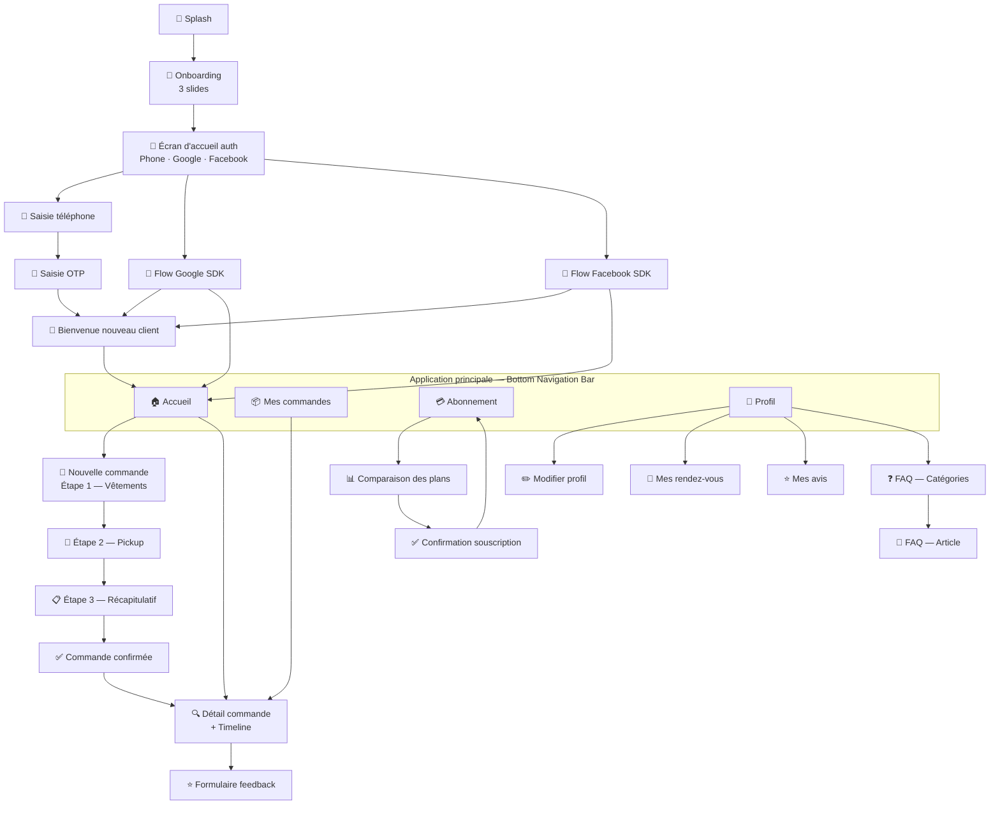
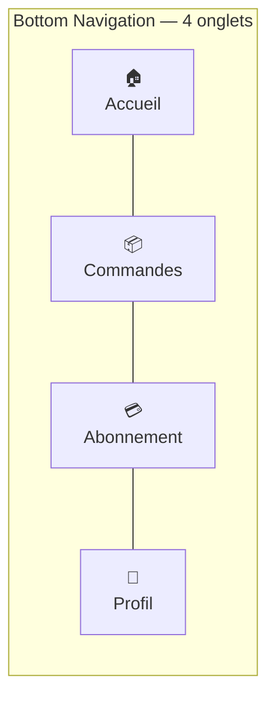

# Kleanet — Proposition des écrans
## Application Mobile Flutter · V1 · Catalogue complet

*Document de design — 2026-02-22*

---

## Table des matières

1. [Architecture de navigation](#1-architecture-de-navigation)
2. [Cartographie complète des écrans](#2-cartographie-complète)
3. [Onboarding & Authentification](#3-onboarding--authentification) (Écrans 1→7)
4. [Navigation principale](#4-navigation-principale) (Bottom bar)
5. [Accueil](#5-accueil--home) (Écran 8)
6. [Flux de commande](#6-flux-de-commande) (Écrans 9→13)
7. [Détail & suivi de commande](#7-détail--suivi) (Écran 14)
8. [Mes commandes](#8-mes-commandes) (Écran 15)
9. [Abonnement](#9-abonnement) (Écrans 16→18)
10. [Profil](#10-profil) (Écrans 19→24)
11. [FAQ](#11-faq) (Écrans 25→26)
12. [Feedback](#12-feedback) (Écran 27)
13. [Système transversal](#13-système-transversal) (Modals, toasts, notifications)
14. [Récapitulatif des 27 écrans](#14-récapitulatif)

---

## 1. Architecture de navigation

### Structure générale



### Bottom Navigation Bar



### Règles de navigation

| Type | Comportement | Exemples |
|------|-------------|---------|
| **Push** | Empile sur la stack courante, flèche retour | Détail commande, FAQ article |
| **Modal** | S'affiche par-dessus, bouton ✕ | Nouvelle commande (flow 3 étapes) |
| **Replace** | Remplace la stack entière | Onboarding → Home, Login → Home |
| **Tab switch** | Change d'onglet sans empiler | Tap sur la bottom nav |

---

## 2. Cartographie complète

| # | Écran | Catégorie | Route Flutter | Accès |
|---|-------|-----------|---------------|-------|
| 1 | Splash | Onboarding | `/splash` | Auto |
| 2 | Onboarding slides | Onboarding | `/onboarding` | 1er lancement |
| 3 | Accueil auth | Auth | `/auth` | Push depuis splash |
| 4 | Saisie téléphone | Auth | `/auth/phone` | Push |
| 5 | Saisie OTP | Auth | `/auth/otp` | Push |
| 6 | Bienvenue nouveau | Auth | `/auth/welcome` | Replace |
| 7 | *(Google/FB : SDK natif)* | Auth | — | — |
| 8 | Accueil | Main | `/home` | Tab 1 |
| 9 | Nouvelle commande — Étape 1 | Commande | `/order/new/garments` | Modal |
| 10 | Nouvelle commande — Étape 2 | Commande | `/order/new/pickup` | Push |
| 11 | Nouvelle commande — Étape 3 | Commande | `/order/new/summary` | Push |
| 12 | Commande confirmée | Commande | `/order/confirmed` | Replace |
| 13 | *(Sélecteur de matière — bottom sheet)* | Commande | — | Bottom sheet |
| 14 | Détail commande | Commande | `/order/:id` | Push |
| 15 | Mes commandes | Main | `/orders` | Tab 2 |
| 16 | Abonnement hub | Main | `/subscription` | Tab 3 |
| 17 | Comparaison des plans | Abonnement | `/subscription/plans` | Push |
| 18 | Confirmation souscription | Abonnement | `/subscription/confirm` | Push |
| 19 | Profil | Main | `/profile` | Tab 4 |
| 20 | Modifier profil | Profil | `/profile/edit` | Push |
| 21 | Mes rendez-vous | Profil | `/profile/appointments` | Push |
| 22 | Mes avis | Profil | `/profile/feedbacks` | Push |
| 23 | FAQ — Catégories | Support | `/faq` | Push |
| 24 | FAQ — Article | Support | `/faq/:id` | Push |
| 25 | Feedback — Formulaire | Feedback | `/feedback/:orderId` | Push |
| 26 | Feedback — Succès | Feedback | `/feedback/success` | Replace |
| 27 | Notifications | Système | `/notifications` | Push (icône 🔔) |

---

## 3. Onboarding & Authentification

---

### Écran 1 — Splash Screen

**Durée** : 2 secondes maximum

```
┌─────────────────────────────┐
│                             │
│                             │
│                             │
│         [LOGO KLEANET]      │
│                             │
│         KLEANET             │
│      Propre à temps         │
│                             │
│                             │
│    ════════════░░░░         │  ← barre de chargement animée
│                             │
└─────────────────────────────┘
```

**Logique en arrière-plan pendant le splash :**
1. Vérifier si un token existe en secure storage
2. Si token → vérifier sa validité silencieusement (appel `/api/v1/profile`)
3. Si valide → naviguer vers Home
4. Si expiré → tenter refresh, si échec → naviguer vers Auth
5. Si aucun token → vérifier si premier lancement (flag local)
6. Premier lancement → Onboarding · Lancement suivant → Auth

**Design** : fond dégradé bleu nuit/cyan (`#1E3A5F → #06B6D4`), logo blanc centré, animation de chargement discrète.

---

### Écran 2 — Onboarding (3 slides)

**Affiché uniquement au premier lancement.**

```
┌─────────────────────────────┐
│                    [Passer] │  ← skip visible sur tous les slides
│                             │
│    ╔═══════════════════╗    │
│    ║   [ILLUSTRATION]  ║    │
│    ║   linge propre    ║    │
│    ╚═══════════════════╝    │
│                             │
│   Fini la corvée            │
│   de linge                  │
│                             │
│   On vient chercher votre   │
│   linge, on lave, on livre. │
│   Vous n'avez rien à faire. │
│                             │
│         ● ○ ○               │  ← indicateur de position
│                             │
│    [──────────────────]     │  ← bouton "Suivant"
└─────────────────────────────┘
```

**Slide 1 — "Fini la corvée de linge"**
- Illustration : personne détendue pendant que le linge tourne
- Message : valeur principale du service

**Slide 2 — "Simple comme bonjour"**
- Illustration : 3 étapes visuelles (commander → pickup → récupérer)
- Message : "3 étapes, 2 minutes"

**Slide 3 — "Transparent et abordable"**
- Illustration : écran de prix avec FCFA
- Message : "30% à la collecte, solde à la livraison. Sans abonnement obligatoire."
- Bouton : "Commencer" (au lieu de "Suivant")

---

### Écran 3 — Accueil authentification

```
┌─────────────────────────────┐
│                             │
│  [LOGO]  KLEANET            │
│                             │
│   ─────────────────────     │
│                             │
│   Connectez-vous ou         │
│   créez votre compte        │
│                             │
│                             │
│  ┌─────────────────────┐    │
│  │  📱  Mon numéro de  │    │
│  │      téléphone      │    │
│  └─────────────────────┘    │
│                             │
│           — ou —            │
│                             │
│  ┌─────────────────────┐    │
│  │  G  Continuer avec  │    │
│  │     Google          │    │
│  └─────────────────────┘    │
│                             │
│  ┌─────────────────────┐    │
│  │  f  Continuer avec  │    │
│  │     Facebook        │    │
│  └─────────────────────┘    │
│                             │
│   En continuant, vous       │
│   acceptez nos [CGV]        │
│                             │
└─────────────────────────────┘
```

**Notes :**
- Les 3 boutons ont une taille identique (égalité visuelle)
- "CGV" est un lien qui ouvre une webview sur `/laundry/cgv`
- Pas de champ email/password (on évite la friction)

---

### Écran 4 — Saisie du numéro de téléphone

```
┌─────────────────────────────┐
│  ←                          │
│                             │
│  Votre numéro               │
│  de téléphone               │
│                             │
│  Nous vous enverrons un     │
│  code pour confirmer        │
│                             │
│  ┌──────┬────────────────┐  │
│  │ +237 │ 6XX XX XX XX   │  │  ← indicatif sélectionnable
│  └──────┴────────────────┘  │
│                             │
│  ┌─────────────────────┐    │
│  │ Envoyer le code SMS │    │  ← désactivé si numéro invalide
│  └─────────────────────┘    │
│                             │
│  Vous n'avez pas de         │
│  téléphone ? [Utiliser un   │
│  email]  ← lien vers Google │
└─────────────────────────────┘
```

**Comportement :**
- Clavier numérique s'affiche automatiquement
- Indicatif pays (+237) sélectionnable avec liste déroulante
- Bouton actif seulement quand format valide
- Feedback visuel en temps réel (bordure verte/rouge)

---

### Écran 5 — Saisie du code OTP

```
┌─────────────────────────────┐
│  ←                          │
│                             │
│  Code de vérification       │
│                             │
│  Entrez le code à 6         │
│  chiffres envoyé au         │
│  +237 6XX XX XX XX          │  ← numéro masqué
│                             │
│  ┌──┐ ┌──┐ ┌──┐ ┌──┐ ┌──┐ ┌──┐ │
│  │4 │ │8 │ │2 │ │  │ │  │ │  │ │  ← 6 cases séparées
│  └──┘ └──┘ └──┘ └──┘ └──┘ └──┘ │
│                             │
│     ⏱ Expire dans 4:23      │  ← compteur en temps réel
│                             │
│  Vous n'avez pas reçu       │
│  le code ?                  │
│  [Renvoyer] (actif après 60s)│
│                             │
│  ┌─────────────────────┐    │
│  │    Vérifier →       │    │  ← s'active après 6 chiffres
│  └─────────────────────┘    │
└─────────────────────────────┘
```

**Comportement :**
- Auto-focus sur la première case
- Avancement automatique case par case
- Paste automatique si SMS intercepté (Android)
- Compteur de temps
- "Renvoyer" désactivé les 60 premières secondes (anti-spam)
- Si code invalide : cases rouges + shake animation + "X essais restants"

---

### Écran 6 — Bienvenue nouveau client

```
┌─────────────────────────────┐
│                             │
│                             │
│         🎉                  │
│                             │
│    Bienvenue chez           │
│    Kleanet !         │
│                             │
│    Bonjour Marie,           │  ← prénom si disponible
│    votre compte est prêt.   │
│                             │
│   ─────────────────────     │
│                             │
│   Passez votre première     │
│   commande en moins         │
│   de 2 minutes.             │
│                             │
│                             │
│  ┌─────────────────────┐    │
│  │  Découvrir l'app →  │    │
│  └─────────────────────┘    │
└─────────────────────────────┘
```

**Affiché uniquement pour les nouveaux comptes** (`is_new_user: true`).
Animation d'entrée des confettis (package `confetti` Flutter).

---

## 4. Navigation principale

### Bottom Navigation Bar — présente sur tous les écrans principaux

```
┌─────────────────────────────┐
│         contenu             │
│                             │
│                             │
│─────────────────────────────│
│  🏠      📦      💳      👤  │
│ Accueil Cmd.  Abnn.  Profil │
└─────────────────────────────┘
```

**Règles :**
- Badge rouge sur "Commandes" si une commande est à l'état `ready` (prête à récupérer)
- Badge rouge sur "Notifications" (icône dans l'AppBar) si notifications non lues
- L'onglet actif est coloré en bleu nuit (`#1E3A5F`), les inactifs en gris
- Appuyer sur un onglet déjà actif → revient à la racine de cet onglet (scroll to top)

### AppBar — commune à tous les écrans principaux

```
┌─────────────────────────────┐
│  [LOGO]  Kleanet  🔔 │  ← icône notifications
└─────────────────────────────┘
```

---

## 5. Accueil — Home

### Écran 8 — Accueil

```
┌─────────────────────────────┐
│  [LOGO]  Kleanet  🔔 │
│─────────────────────────────│
│                             │
│  Bonjour Marie 👋            │
│  Que faisons-nous           │
│  aujourd'hui ?              │
│                             │
│  ╔═══════════════════════╗  │
│  ║  💳 Kleanet+ Confort   ║  │  ← si abonné
│  ║  3,5 kg restants      ║  │
│  ║  ████████░░ 70%       ║  │
│  ╚═══════════════════════╝  │
│    (masqué si pas d'abo)    │
│                             │
│  ─── Commandes en cours ─── │
│                             │
│  ╔═══════════════════════╗  │
│  ║ LORD/00156            ║  │
│  ║ 🟡 En traitement      ║  │
│  ║ 5 articles · 4 800 XAF║  │
│  ║ Pickup: lundi 09h00   ║  │
│  ╚═══════════════════════╝  │
│                             │
│  ╔═══════════════════════╗  │
│  ║ LORD/00155            ║  │
│  ║ ✅ Prêt à récupérer   ║  │  ← mise en évidence spéciale
│  ╚═══════════════════════╝  │
│                             │
│  Pas de commande en cours ? │
│  ─────────────────────────  │
│                             │
│─────────────────────────────│
│  🏠      📦      💳      👤  │
└─────────────────────────────┘
│            [+ Nouvelle commande]│  ← FAB violet, toujours visible
```

**Composants :**
- **Carte abonnement** (conditionnelle) : affichée si abonnement actif. Barre de progression quota. Tap → onglet Abonnement.
- **Cards commandes actives** : uniquement les commandes non terminées (`status != "delivered"` et `status != "cancelled"`). Triées par état le plus urgent (`ready_for_pickup` en premier, puis `processing`, puis `received`, puis `pending`).
- **Card spéciale "Prêt"** : fond coloré, pulsation, texte "Votre linge vous attend !"
- **FAB (Floating Action Button)** : bouton "+" en bas à droite, toujours visible sur l'accueil.
- Si aucune commande active : message encourageant + illustration.

**Pull-to-refresh** sur toute la page.

---

## 6. Flux de commande

---

### Écran 9 — Nouvelle commande · Étape 1 · Sélection des vêtements

```
┌─────────────────────────────┐
│  ✕          1 ● 2 ○ 3 ○     │  ← fermer + indicateur étapes
│  Sélectionnez vos           │
│  vêtements                  │
│─────────────────────────────│
│                             │
│  👔 Chemise / Chemisier      │
│  ─────────────────────       │
│  ┌──────────┐ ┌──────────┐  │
│  │ Coton    │ │ Synthét. │  │  ← chips de matière
│  │ ✓ sélect │ │          │  │
│  └──────────┘ └──────────┘  │
│         1 200 XAF/pièce     │
│         [−]   2   [+]       │  ← compteur +/-
│                             │
│  👖 Pantalon                 │
│  ─────────────────────       │
│  ┌──────────┐ ┌──────────┐  │
│  │ Coton    │ │ Jean     │  │
│  └──────────┘ └──────────┘  │
│         800 XAF/kg          │
│         [−]  0,5kg  [+]     │
│                             │
│  👗 Robe                     │
│  ...                        │
│                             │
│ ─────────────────────────── │
│  2 articles · Total estimé  │
│        4 200 XAF            │
│                             │
│  ┌─────────────────────┐    │
│  │  Choisir le pickup →│    │
│  └─────────────────────┘    │
└─────────────────────────────┘
```

**Comportement :**
- Liste scrollable de tous les types de vêtements (chargée depuis le cache API)
- Chips de matière : sélectionner une matière est optionnel
- Compteur `−/+` : pour les articles "per_piece" c'est une quantité entière ; pour les articles "per_kg" c'est un poids avec pas de 0,5kg
- Total recalculé en temps réel à chaque modification
- Bouton "Choisir le pickup" actif seulement si au moins 1 article > 0

---

### Écran 10 — Nouvelle commande · Étape 2 · Pickup & Adresse

```
┌─────────────────────────────┐
│  ←          1 ✓ 2 ● 3 ○    │
│  Quand et où venons-nous    │
│  chercher votre linge ?     │
│─────────────────────────────│
│                             │
│  📅 Date de passage         │
│  ─────────────────────      │
│   < Février 2026 >          │
│  Lu  Ma  Me  Je  Ve  Sa  Di │
│  ──────────────────────── │
│   2   3   4   5   6   7   8 │
│   9  10  11  12  13  14  15 │
│  16  17 [18] 19  20  21  22 │  ← [18] = aujourd'hui, grisé
│  23  24  25 (26) 27  28     │  ← (26) = date sélectionnée
│  ──────────────────────── │
│                             │
│  Heure de passage           │
│  ┌────────────────────────┐ │
│  │ ○ 07h00  ● 09h00  ○ 11h│ │
│  │ ○ 13h00  ○ 15h00  ○ 17h│ │
│  └────────────────────────┘ │
│                             │
│  ─────────────────────────  │
│  📍 Adresse de collecte     │
│  ─────────────────────────  │
│                             │
│  [SI position déjà enreg.]  │
│  ╔═══════════════════════╗  │
│  ║ 📌 Position enregistrée║ │
│  ║ Biyem-Assi (~200m)    ║  │
│  ║ ░░░░░▓▓░░░░░░░░░░░░░░ ║  │  ← mini-carte statique
│  ║ [Utiliser cette adresse]║ │
│  ║ [Utiliser ma position  ]║ │
│  ║ [ GPS actuelle        ]║  │
│  ╚═══════════════════════╝  │
│                             │
│  [SI aucune position enreg.]│
│  ┌─────────────────────┐    │
│  │ 📍 Utiliser ma      │    │
│  │    position GPS     │    │
│  └─────────────────────┘    │
│  💾 Sera sauvegardée pour   │
│  vos prochaines commandes   │
│                             │
│  ┌─────────────────────┐    │
│  │   Voir le résumé →  │    │
│  └─────────────────────┘    │
└─────────────────────────────┘
```

**Comportement calendrier :**
- Jours passés et aujourd'hui : grisés, non sélectionnables
- Minimum : demain (J+1)
- Heures : grille de boutons radio, pas de picker (plus simple sur mobile)
- Heures < 2h à l'avance : désactivées

**Comportement adresse :**
- Au chargement de l'écran, l'app appelle `GET /api/v1/profile` et vérifie `delivery_location`
- **Si position enregistrée** : afficher la mini-carte + option "Utiliser cette adresse" (pré-sélectionnée) ou "Utiliser ma position GPS actuelle" (si le client commande depuis un autre lieu)
- **Si aucune position** : proposer "Utiliser ma position GPS" avec mention que la position sera sauvegardée
- Appui sur "Utiliser ma position GPS" → demande permission `location` si nécessaire → capture les coordonnées → appel `PATCH /api/v1/profile/location` → confirmation "Position enregistrée"
- Les coordonnées sont envoyées dans `delivery_location` lors du `POST /api/v1/orders`
- La mini-carte est un widget statique `flutter_map` (OpenStreetMap, gratuit, pas de clé API)

---

### Écran 11 — Nouvelle commande · Étape 3 · Récapitulatif

```
┌─────────────────────────────┐
│  ←          1 ✓ 2 ✓ 3 ●    │
│  Récapitulatif              │
│─────────────────────────────│
│                             │
│  📦 Vos vêtements           │
│  ─────────────────────      │
│  Chemise coton       × 2    │
│                  2 400 XAF  │
│  Pantalon jean    × 0,5 kg  │
│                    400 XAF  │
│                             │
│  ─────────────────────      │
│  Total estimé     2 800 XAF │
│  ─────────────────────      │
│                             │
│  📅 Pickup                  │
│  Jeudi 26 mars à 09h00      │
│  [Modifier]                 │
│                             │
│  📍 Adresse de collecte     │
│  Biyem-Assi (position GPS)  │
│  [Modifier]                 │
│                             │
│  💳 Paiement                │
│  À la récupération          │
│  Espèces ou mobile money    │
│                             │
│  ────────────────────────── │
│  En confirmant, vous        │
│  acceptez que Kleanet        │
│  récupère votre linge.      │
│                             │
│  ┌─────────────────────┐    │
│  │  ✅ Confirmer la    │    │
│  │     commande        │    │
│  └─────────────────────┘    │
│  [Modifier les articles]    │
└─────────────────────────────┘
```

**Note** : "Total estimé" car le poids exact est pesé à la réception. Le prix final peut légèrement varier.

---

### Écran 12 — Commande confirmée

```
┌─────────────────────────────┐
│                             │
│                             │
│      ✅ (animation)         │
│                             │
│   Commande confirmée !      │
│                             │
│   Votre numéro              │
│   ┌─────────────────────┐   │
│   │    LORD / 00156     │   │
│   └─────────────────────┘   │
│                             │
│   📅 Pickup prévu           │
│   Jeudi 26 mars à 09h00     │
│                             │
│   Vous recevrez un SMS      │
│   de confirmation.          │
│                             │
│   ─────────────────────     │
│                             │
│  ┌─────────────────────┐    │
│  │ 🔍 Suivre ma commande│   │
│  └─────────────────────┘    │
│                             │
│  [Retour à l'accueil]       │
│                             │
└─────────────────────────────┘
```

**Animation :** checkmark se dessine progressivement + confettis légers.
**Navigation :** "Suivre ma commande" → push vers Écran 14 (Détail commande).

---

## 7. Détail & Suivi

### Écran 14 — Détail commande & Timeline

```
┌─────────────────────────────┐
│  ←   LORD/00156          🔗 │  ← partager le lien de tracking
│─────────────────────────────│
│                             │
│  Jean-Baptiste · 2 800 XAF  │
│  Jeudi 26 mars              │
│                             │
│  ─── Statut ───────────     │
│                             │
│  ✅ En attente    26 mars    │
│  │  10:32                   │
│  ✅ Linge reçu   26 mars    │
│  │  14:15                   │
│  🔄 En traitement            │  ← état actuel — pulsation
│  │  (en cours)              │
│  ○  Prêt à récupérer        │
│  │                          │
│  ○  Livré                   │
│                             │
│  ─── Votre linge ──────     │
│  Chemise coton     × 2      │
│  Pantalon jean  × 0,5 kg    │
│                             │
│  ─── QR Code ──────────     │
│  ┌─────────────────────┐    │
│  │  ░░▓░░▓░░▓░░▓░░▓░░ │    │
│  │  ░▓░░░░░░░░░░░░░▓░ │    │  ← QR code
│  │  ░▓░ ████████ ░▓░ │    │
│  │  ...               │    │
│  └─────────────────────┘    │
│  [Agrandir]  [Partager]     │
│                             │
└─────────────────────────────┘
```

**Comportement :**
- Pull-to-refresh pour actualiser le statut
- Quand état API = `ready_for_pickup` : tout l'écran a une bannière verte en haut "🎉 Votre linge vous attend !"
- Quand état API = `delivered` : bouton "Laisser un avis" apparaît en bas
- QR code en tap → plein écran sur fond blanc (pour faciliter le scan)
- Icône 🔗 en haut → ouvre le lien de tracking web (partage WhatsApp, etc.)

---

## 8. Mes commandes

### Écran 15 — Liste de mes commandes

```
┌─────────────────────────────┐
│  [LOGO]  Kleanet  🔔 │
│─────────────────────────────│
│  ┌──────┐ ┌────────┐ ┌────┐ │
│  │ Tout │ │En cours│ │Fait│ │  ← filtres
│  └──────┘ └────────┘ └────┘ │
│─────────────────────────────│
│                             │
│  ╔═══════════════════════╗  │
│  ║ LORD/00156            ║  │
│  ║ 🔄 En traitement      ║  │
│  ║ Jeu 26 mars · 2 800 XAF║ │
│  ╚═══════════════════════╝  │
│                             │
│  ╔═══════════════════════╗  │
│  ║ LORD/00155 ✅ PRÊT    ║  │  ← fond vert clair
│  ║ Mar 24 mars · 4 800 XAF║ │
│  ╚═══════════════════════╝  │
│                             │
│  ╔═══════════════════════╗  │
│  ║ LORD/00150            ║  │
│  ║ ✓ Livré               ║  │
│  ║ Lun 15 mars · 3 200 XAF║ │
│  ╚═══════════════════════╝  │
│                             │
│  ╔═══════════════════════╗  │
│  ║ LORD/00145 ⭐          ║  │  ← icône si déjà noté
│  ║ ✓ Livré               ║  │
│  ╚═══════════════════════╝  │
│                             │
│  [Charger plus...]          │
│─────────────────────────────│
│  🏠      📦      💳      👤  │
└─────────────────────────────┘
```

**Filtres :** "Tout" · "En cours" (`status` = `pending` / `received` / `processing` / `ready_for_pickup`) · "Terminées" (`status` = `delivered` / `cancelled`)
**Badge** sur l'onglet "Commandes" si une commande a le statut `ready_for_pickup`.

---

## 9. Abonnement

### Écran 16 — Hub Abonnement (sans abonnement actif)

```
┌─────────────────────────────┐
│  [LOGO]  Kleanet  🔔 │
│─────────────────────────────│
│                             │
│   💳 Abonnement             │
│                             │
│  ╔═══════════════════════╗  │
│  ║  ✨ Rejoignez Kleanet+ ║  │
│  ║  Économisez jusqu'à   ║  │
│  ║  30% avec un plan     ║  │
│  ║  mensuel              ║  │
│  ╚═══════════════════════╝  │
│                             │
│  Avantages Kleanet+ :        │
│  ✓ Tarif préférentiel       │
│  ✓ Pickup prioritaire       │
│  ✓ Suivi dédié              │
│  ✓ Sans engagement          │
│                             │
│                             │
│  ┌─────────────────────┐    │
│  │ Voir les plans →    │    │
│  └─────────────────────┘    │
│                             │
│─────────────────────────────│
│  🏠      📦      💳      👤  │
└─────────────────────────────┘
```

---

### Écran 16-B — Hub Abonnement (avec abonnement actif)

```
┌─────────────────────────────┐
│  [LOGO]  Kleanet  🔔 │
│─────────────────────────────│
│                             │
│  ╔═══════════════════════╗  │
│  ║  💳 Kleanet+ Confort   ║  │
│  ║  15 000 XAF / mois    ║  │
│  ║  Actif depuis 1er mars║  │
│  ║  Renouvellement : 1er avr║│
│  ╚═══════════════════════╝  │
│                             │
│  ─── Quota mars ────────    │
│  Poids    ████████░░ 8/10kg │
│  Pièces   ██░░░░░░░░ 3/20   │
│  Pickups  ██░░ 1/2 cette sem│
│                             │
│  ─── Commandes du mois ──   │
│  LORD/00156  🔄  2 800 XAF  │
│  LORD/00150  ✓   3 200 XAF  │
│  LORD/00145  ✓   4 100 XAF  │
│                             │
│  Total mars : 10 100 XAF    │
│                             │
│─────────────────────────────│
│  🏠      📦      💳      👤  │
└─────────────────────────────┘
```

---

### Écran 17 — Comparaison des plans

```
┌─────────────────────────────┐
│  ←   Choisir un plan        │
│─────────────────────────────│
│                             │
│  ┌─────────────────────┐    │
│  │  🌱 Essentiel       │    │
│  │  8 000 XAF / mois   │    │
│  │  ─────────────────  │    │
│  │  ✓ 10 kg inclus     │    │
│  │  ✓ 10 pièces sp.    │    │
│  │  ✓ 1 pickup/semaine │    │
│  │  + 500 XAF/kg suppl.│    │
│  │  ✓ Sans engagement  │    │
│  │  [Choisir]          │    │
│  └─────────────────────┘    │
│                             │
│  ┌─────────────────────┐    │
│  │ ⭐ RECOMMANDÉ        │    │  ← badge
│  │  💎 Confort         │    │
│  │  15 000 XAF / mois  │    │
│  │  ─────────────────  │    │
│  │  ✓ 20 kg inclus     │    │
│  │  ✓ 30 pièces sp.    │    │
│  │  ✓ 2 pickups/semaine│    │
│  │  + 400 XAF/kg suppl.│    │
│  │  ✓ Sans engagement  │    │
│  │  [Choisir]          │    │
│  └─────────────────────┘    │
│                             │
│  ┌─────────────────────┐    │
│  │  🏢 Business        │    │
│  │  30 000 XAF / mois  │    │
│  │  ─────────────────  │    │
│  │  ✓ 50 kg inclus     │    │
│  │  ✓ Pièces illimitées│    │
│  │  ✓ 5 pickups/semaine│    │
│  │  + 300 XAF/kg suppl.│    │
│  │  ✓ Sans engagement  │    │
│  │  [Choisir]          │    │
│  └─────────────────────┘    │
│                             │
└─────────────────────────────┘
```

**Note :** les tarifs et le coût de dépassement (`overage_price_per_kg`) sont indicatifs — ils viennent de l'API (`GET /api/v1/catalog/subscription-plans`) et peuvent être mis à jour depuis Odoo.

---

### Écran 18 — Confirmation souscription

```
┌─────────────────────────────┐
│  ←   Confirmer              │
│─────────────────────────────│
│                             │
│  Vous avez sélectionné :    │
│                             │
│  ╔═══════════════════════╗  │
│  ║  💎 Plan Confort      ║  │
│  ║  15 000 XAF / mois    ║  │
│  ╚═══════════════════════╝  │
│                             │
│  Inclus chaque mois :       │
│  ─────────────────────      │
│  • 20 kg de linge           │
│  • 30 pièces spéciales      │
│  • 2 pickups / semaine      │
│  • + 400 XAF / kg suppl.   │
│                             │
│  Activation : immédiate     │
│  Paiement : mensuel         │
│             sur place       │
│  Engagement : aucun         │
│                             │
│  ────────────────────────── │
│                             │
│  ┌─────────────────────┐    │
│  │  ✅ S'abonner       │    │
│  └─────────────────────┘    │
│  [Choisir un autre plan]    │
└─────────────────────────────┘
```

Après confirmation : animation "🎉 Bienvenue dans Kleanet+ !" puis retour vers Écran 16-B.

---

## 10. Profil

### Écran 19 — Profil principal

```
┌─────────────────────────────┐
│  [LOGO]  Kleanet  🔔 │
│─────────────────────────────│
│                             │
│     👤                      │
│     Marie Dupont            │
│     +237 612 345 678        │
│     [Modifier le profil]    │
│                             │
│  ─── Mon compte ──────────  │
│                             │
│  📦  Mes commandes       →  │
│  📅  Mes rendez-vous     →  │
│  ⭐  Mes avis             →  │
│                             │
│  ─── Support ─────────────  │
│                             │
│  ❓  FAQ                  →  │
│  📄  Conditions générales →  │
│                             │
│  ─── ──────────────────── ─ │
│                             │
│  🔴 Se déconnecter          │
│                             │
│  Version 1.0.0              │
│─────────────────────────────│
│  🏠      📦      💳      👤  │
└─────────────────────────────┘
```

---

### Écran 20 — Modifier le profil

```
┌─────────────────────────────┐
│  ←   Mon profil             │
│─────────────────────────────│
│                             │
│  Nom complet                │
│  ┌─────────────────────┐    │
│  │ Marie Dupont        │    │
│  └─────────────────────┘    │
│                             │
│  Email                      │
│  ┌─────────────────────┐    │
│  │ marie@exemple.com   │    │
│  └─────────────────────┘    │
│                             │
│  Téléphone (non modifiable) │
│  ┌─────────────────────┐    │
│  │ 🔒 +237 612 345 678 │    │  ← grisé, non éditable
│  └─────────────────────┘    │
│                             │
│  ℹ️ Le numéro est lié à     │
│  votre authentification     │
│                             │
│  ─────────────────────────  │
│  📍 Adresse de livraison    │
│  ─────────────────────────  │
│                             │
│  [SI position déjà enreg.]  │
│  ╔═══════════════════════╗  │
│  ║ ░░░░░▓▓░░░░░░░░░░░░░░ ║  │  ← mini-carte flutter_map
│  ║ ░░░░░░📌░░░░░░░░░░░░░ ║  │
│  ║ ░░░░░░░░░░░░░░░░░░░░░ ║  │
│  ╚═══════════════════════╝  │
│  Biyem-Assi                 │
│  3.8516° N · 11.5020° E     │
│  ┌─────────────────────┐    │
│  │ 📍 Mettre à jour    │    │
│  │    ma position      │    │
│  └─────────────────────┘    │
│                             │
│  [SI aucune position]       │
│  ┌─────────────────────┐    │
│  │ 📍 Enregistrer ma   │    │
│  │    position GPS     │    │
│  └─────────────────────┘    │
│  Permet au livreur de vous  │
│  trouver facilement         │
│                             │
│  ┌─────────────────────┐    │
│  │   Enregistrer       │    │
│  └─────────────────────┘    │
└─────────────────────────────┘
```

**Comportement adresse de livraison :**
- `PATCH /api/v1/profile/location` appelé immédiatement quand le client appuie sur "Mettre à jour / Enregistrer ma position"
- Permission GPS demandée si pas encore accordée (`permission_handler`)
- Après capture : toast "Position enregistrée" + mini-carte se met à jour
- Le bouton "Enregistrer" du formulaire principal ne déclenche que `PATCH /api/v1/profile` (nom + email) — la position est sauvegardée indépendamment et immédiatement

---

### Écran 21 — Mes rendez-vous

```
┌─────────────────────────────┐
│  ←   Mes rendez-vous        │
│─────────────────────────────│
│  ┌──────────┐ ┌──────────┐  │
│  │ À venir  │ │  Passés  │  │
│  └──────────┘ └──────────┘  │
│                             │
│  ╔═══════════════════════╗  │
│  ║  📦 Pickup            ║  │
│  ║  Jeu 26 mars · 09h00  ║  │
│  ║  LORD/00156           ║  │
│  ║  🟡 Planifié           ║  │
│  ╚═══════════════════════╝  │
│                             │
│  ╔═══════════════════════╗  │
│  ║  📦 Pickup            ║  │
│  ║  Lun 30 mars · 14h00  ║  │
│  ║  ─ Pas encore lié ─   ║  │
│  ╚═══════════════════════╝  │
│                             │
└─────────────────────────────┘
```

---

### Écran 22 — Mes avis

```
┌─────────────────────────────┐
│  ←   Mes avis               │
│─────────────────────────────│
│                             │
│  ╔═══════════════════════╗  │
│  ║  LORD/00150           ║  │
│  ║  ⭐⭐⭐⭐⭐ 15 mars        ║  │
│  ║  "Service rapide et   ║  │
│  ║   très propre !"      ║  │
│  ║  👍 Recommande        ║  │
│  ╚═══════════════════════╝  │
│                             │
│  ╔═══════════════════════╗  │
│  ║  LORD/00145           ║  │
│  ║  ⭐⭐⭐⭐ 8 mars          ║  │
│  ║  "RAS, bien lavé"     ║  │
│  ╚═══════════════════════╝  │
│                             │
│  Commandes sans avis :      │
│  LORD/00155 → [Laisser avis]│
│                             │
└─────────────────────────────┘
```

---

## 11. FAQ

### Écran 23 — FAQ Catégories

```
┌─────────────────────────────┐
│  ←   Questions fréquentes   │
│─────────────────────────────│
│                             │
│  ┌─────────────────────┐    │
│  │ 🔍 Rechercher...    │    │
│  └─────────────────────┘    │
│                             │
│  ╔═══════════════════════╗  │
│  ║  💰 Tarifs & Prix     ║  │
│  ║  8 questions          ║  │
│  ╚═══════════════════════╝  │
│                             │
│  ╔═══════════════════════╗  │
│  ║  🚗 Livraison & Pickup║  │
│  ║  5 questions          ║  │
│  ╚═══════════════════════╝  │
│                             │
│  ╔═══════════════════════╗  │
│  ║  💳 Abonnements       ║  │
│  ║  6 questions          ║  │
│  ╚═══════════════════════╝  │
│                             │
│  ╔═══════════════════════╗  │
│  ║  👔 Traitement linge  ║  │
│  ║  4 questions          ║  │
│  ╚═══════════════════════╝  │
│                             │
│  ╔═══════════════════════╗  │
│  ║  ⚠️  Réclamations     ║  │
│  ║  3 questions          ║  │
│  ╚═══════════════════════╝  │
└─────────────────────────────┘
```

**Accessible sans être connecté.**

---

### Écran 24 — FAQ Article

```
┌─────────────────────────────┐
│  ←   Tarifs & Prix          │
│─────────────────────────────│
│                             │
│  Comment sont calculés      │
│  les prix ?                 │
│                             │
│  Nos tarifs dépendent du    │
│  type de vêtement :         │
│                             │
│  • Articles standard        │
│    (chemises, pantalons...) │
│    → Tarif au kilo          │
│    → 800 XAF / kg           │
│                             │
│  • Articles spéciaux        │
│    (vestes, robes de soirée,│
│    costumes...)             │
│    → Tarif à la pièce       │
│    → 1 200 à 3 000 XAF/pièce│
│                             │
│  Le prix affiché lors de    │
│  la commande est une        │
│  estimation. Le prix final  │
│  est calculé après pesée.   │
│                             │
│  ─── Cet article vous       │
│      a-t-il aidé ? ─────    │
│  [👍 Oui]      [👎 Non]     │
└─────────────────────────────┘
```

---

## 12. Feedback

### Écran 25 — Formulaire de feedback

```
┌─────────────────────────────┐
│  ←   Votre avis             │
│─────────────────────────────│
│                             │
│  Commande LORD/00150        │
│  Livrée le 15 mars          │
│                             │
│  Comment s'est passée       │
│  cette prestation ?         │
│                             │
│       ☆  ☆  ☆  ☆  ☆         │  ← étoiles tap pour noter
│                             │
│  (après sélection 4 étoiles)│
│       ⭐ ⭐ ⭐ ⭐ ☆            │
│       "Très bien !"         │  ← label contextuel
│                             │
│  Un commentaire ? (optionnel)│
│  ┌─────────────────────┐    │
│  │ Le linge était très │    │
│  │ propre et bien plié │    │
│  │                     │    │
│  └─────────────────────┘    │
│                             │
│  Recommanderiez-vous        │
│  Kleanet à un ami ?          │
│  ┌──────────┐ ┌──────────┐  │
│  │  👍 Oui  │ │  👎 Non  │  │
│  └──────────┘ └──────────┘  │
│                             │
│  ┌─────────────────────┐    │
│  │  Envoyer mon avis → │    │
│  └─────────────────────┘    │
└─────────────────────────────┘
```

**Label contextuel selon les étoiles :**
- 1 ⭐ → "Mauvaise expérience"
- 2 ⭐⭐ → "Peut mieux faire"
- 3 ⭐⭐⭐ → "Correct"
- 4 ⭐⭐⭐⭐ → "Très bien !"
- 5 ⭐⭐⭐⭐⭐ → "Excellent ! 🎉"

---

### Écran 26 — Feedback envoyé avec succès

```
┌─────────────────────────────┐
│                             │
│                             │
│         ⭐⭐⭐⭐⭐             │
│                             │
│    Merci pour votre         │
│    retour !                 │
│                             │
│    Votre avis nous aide     │
│    à améliorer notre        │
│    service chaque jour.     │
│                             │
│                             │
│  ┌─────────────────────┐    │
│  │  Retour à l'accueil │    │
│  └─────────────────────┘    │
│                             │
└─────────────────────────────┘
```

---

## 13. Système transversal

### Écran 27 — Centre de notifications

```
┌─────────────────────────────┐
│  ←   Notifications          │
│─────────────────────────────│
│                             │
│  Aujourd'hui                │
│  ─────────────────────      │
│  🎉 Votre linge est prêt !  │
│     LORD/00156 · Il y a 2h  │
│                             │
│  Hier                       │
│  ─────────────────────      │
│  🔄 Linge en cours          │
│     LORD/00156 · Hier 14h00 │
│  ✅ Linge reçu par Kleanet   │
│     LORD/00156 · Hier 11h30 │
│  📦 Commande confirmée      │
│     LORD/00156 · Hier 10h00 │
│                             │
│  La semaine dernière        │
│  ─────────────────────      │
│  ⭐ Merci pour votre avis ! │
│     LORD/00150 · 15 mars    │
│                             │
└─────────────────────────────┘
```

**Badge** sur l'icône 🔔 de l'AppBar si notifications non lues.

---

### Composants transversaux

#### Toast / Snackbar
Affiché en bas de l'écran, disparaît après 3 secondes :
- ✅ Succès : fond vert, texte blanc
- ❌ Erreur : fond rouge, texte blanc
- ⚠️ Avertissement : fond orange

#### État de chargement
- **Skeleton screens** : placeholder animé pendant le chargement (meilleur UX que spinner seul)
- **Pull-to-refresh** : sur toutes les listes

#### Écran d'erreur réseau
```
┌─────────────────────────────┐
│                             │
│    📡                       │
│                             │
│    Pas de connexion         │
│                             │
│    Vérifiez votre           │
│    connexion internet       │
│                             │
│  [Réessayer]                │
└─────────────────────────────┘
```

#### Empty state (liste vide)
Illustration + message + CTA selon le contexte :
- 0 commandes → "Passez votre première commande !" + bouton
- 0 FAQ → "Aucun résultat" + lien contact

#### Dialog de confirmation
Pour les actions irréversibles (déconnexion, annulation d'une commande) :
```
┌─────────────────────────────┐
│                             │
│  Se déconnecter ?           │
│                             │
│  Vous devrez vous           │
│  reconnecter.               │
│                             │
│  [Annuler]  [Se déconnecter]│
└─────────────────────────────┘
```

---

## 14. Récapitulatif

### Les 27 écrans

| # | Écran | Accès | Auth requise |
|---|-------|-------|-------------|
| 1 | Splash | Automatique | ✗ |
| 2 | Onboarding (3 slides) | 1er lancement | ✗ |
| 3 | Accueil auth | Push | ✗ |
| 4 | Saisie téléphone | Push | ✗ |
| 5 | Saisie OTP | Push | ✗ |
| 6 | Bienvenue nouveau client | Replace | ✗ |
| 7 | *(Google/FB SDK — pas un écran Flutter)* | — | — |
| 8 | Accueil | Tab | ✅ |
| 9 | Nouvelle commande — Étape 1 | Modal | ✅ |
| 10 | Nouvelle commande — Étape 2 | Push | ✅ |
| 11 | Nouvelle commande — Étape 3 | Push | ✅ |
| 12 | Commande confirmée | Replace | ✅ |
| 13 | *(Bottom sheet matière)* | — | — |
| 14 | Détail commande | Push | ✅ |
| 15 | Mes commandes | Tab | ✅ |
| 16 | Abonnement hub | Tab | ✅ |
| 17 | Comparaison des plans | Push | ✅ |
| 18 | Confirmation souscription | Push | ✅ |
| 19 | Profil | Tab | ✅ |
| 20 | Modifier profil | Push | ✅ |
| 21 | Mes rendez-vous | Push | ✅ |
| 22 | Mes avis | Push | ✅ |
| 23 | FAQ — Catégories | Push | ✗ |
| 24 | FAQ — Article | Push | ✗ |
| 25 | Feedback — Formulaire | Push | ✅ |
| 26 | Feedback — Succès | Replace | ✅ |
| 27 | Centre de notifications | Push | ✅ |

**Total écrans uniques : 25** (+ 2 composants système non-écrans)

**Sans auth :** 7 écrans (onboarding, auth, FAQ)
**Avec auth :** 18 écrans (tout le reste)

---

### Palette de couleurs suggérée

| Usage | Couleur | Hex |
|-------|---------|-----|
| Primaire | Bleu nuit | `#1E3A5F` |
| Accent 1 | Cyan | `#06B6D4` |
| Accent 2 | Violet | `#4F46E5` |
| Succès | Vert | `#10B981` |
| Alerte | Orange | `#F59E0B` |
| Erreur | Rouge | `#EF4444` |
| Fond | Blanc | `#FFFFFF` |
| Fond secondaire | Gris très clair | `#F8FAFC` |
| Texte principal | Gris foncé | `#1F2937` |
| Texte secondaire | Gris moyen | `#6B7280` |

---

### Polices suggérées

| Usage | Police | Taille |
|-------|--------|--------|
| Titres | Inter SemiBold | 20-28sp |
| Corps | Inter Regular | 14-16sp |
| Légendes | Inter Regular | 12sp |
| Montants | Inter Bold | 16-24sp |

*Inter est disponible sur Google Fonts, excellente lisibilité sur mobile.*

---

*Document de proposition d'écrans — Kleanet Mobile — 2026-02-22*
*Prochaine étape : finaliser l'API, puis initier le projet Flutter*
